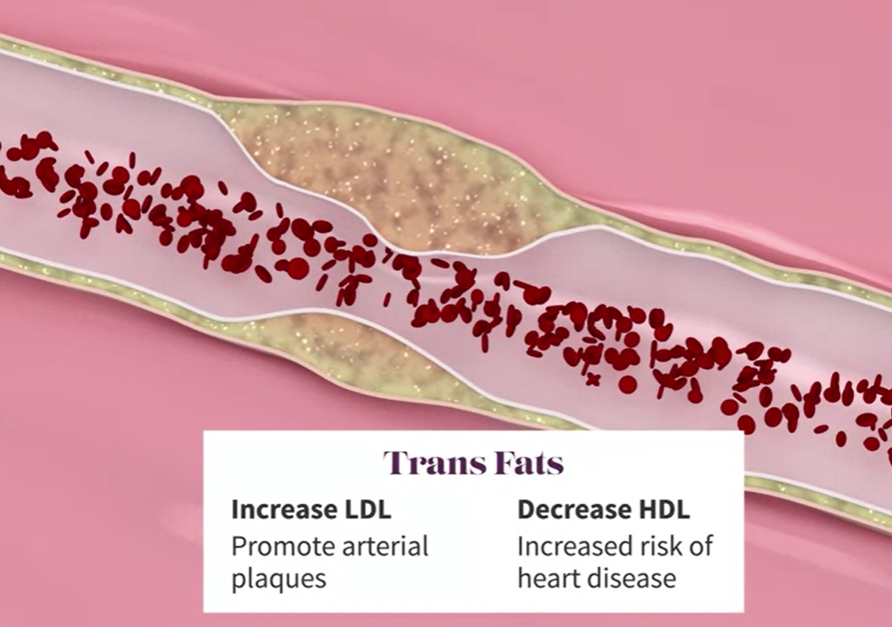

# Week 1

## A Sociocultural History of Obesity

- 1st part of 20th century
    - more inexpensive food
    - less physical activity
    - more women entering workforce
    - more fast convenience foods
    - fewer meals cooked at home
    - increased calories intake
    - outsourced food
        - less healthy
        - eat more - snacks

- 2ns half of the 20th century
    - focus on reduce saturated and total fat
    - added more sugar (corn sugar)
        - food is more appealing
        - increased shelf life
    - fuel for obesity and diabet
    - lead to an increase in obesity

## Macronutrient Structure & Metabolism
- wee need oxygen, water and food to survive
- 1827 proposed 3 macronutrients
    - find good proportions
    - can be confusing
    - course focuses on food, not nutrients
- understanding nutrients

### Nutrients categories

#### Carbohydrates
- Simple
    - Monosaccharides
        - Glucose
        - Fructose
    - Disaccharides
        - Sucrose - table sugar
- Complex
    - Polysaccharides
        - Starch - an digest
        - Dietary fiber - can't digest
- during digestion carbohydrates are broken down and converted to glucose
- glucose can be metabolized into usable energy - ATP
- if energy demands are low - glucose can be stored as (mostly) adipose tissue

#### Protein
- broken to Amino Acids during digestion
- used to repare tissue and perform many other important functions
- can be broken down and used as energy
- can contribute to fat stores

#### Fat
- broken into smaller components
- used as energy
- the most energy dense storage form:
    - fat - 9 Cal/g
    - alcohol - 7 Cal/g
    - carbs - 4 Cal/g
    - proteins - 4 Cal/g

Any calories that aren't converted into usable energy in the form of ATP are stored in the body for later use.

We need an equilibrum between energy expenditure and energy intake.

### Carbohydrates

Not all caarbs are the same

- Lots of popular diet trends that encurage lowering carbohydrates
- this diets seem to suggest that protein and fat can be eaten freely
- this kinds of diets can leave us with problems in the long run
- carbohydrates include both foods that are important for our health and foods that can compromise it
- Whole grains like brown rice and rolled oats are carbohydrates that provide our bodies with a usable source of energy and bound together in that very same food is a significant amount of fiber, which slows the release of glucose from that food into the bloodstream.

#### Glycemic index 
The glycemic index of a food is the measure of the speed at which glucose is released into the blood stream after it's digested

- for whole grains (brown rice, quinoa): slower release of glucose and a more muted insulin response 
- foods containing fiber and pairing foods with proteins and dietary fats

- refined carbohydrates (white bread, soda): rapid release of glucose into the blod and large amount of insulin
    - unstable blod sugar
    - early return of hunger
    - tendency to overeat

### Proteins

The building blocks for the main tissues of our body and have many other roles (cell signaling, cellular structure, hormonal proteins, immune functions)

There are 20 types of Amino Acids, 9 of them are essentials - we can't prodce enough of them and need to be in our food

- complete sources: fish, eggs
- incomplete sources: beans, nuts, lentils and tofu
- this doesn't mean animal proteins are superior, actually plant based proteins can be combined to a complete amino acitd profile (eg: corn+black beans; rice+lentils)
- meals containing vegetarian sources of protein also contain more fiber and less fat than animal based meals.

- plant based diets are tipically healthier than high animal based diets
- diets high in animal protein, especially if it is low quality, like processed meats or high fat cuts can be harmfull
- processed meats often contain nitrates (harden arteries) and high sodium (higher blood presure)

- the most sensible diets should include: high quality protein foods from a variety of sources( include fish) and have plenty of combined vegerarian sources.

### Fats
Fats play important roles in our bodies: energy storage, insulation, protection of internal organs, brain development 

The increased availability of fat free foods did not solve the obesity issue.
Learning about good fats and bad fats helps us.

#### Saturated fats

- fatty acids are saturated with hydrogen molecules
- packed together densly - solid are room temperature

#### Unsaturated fats

- less saturated with hydrogen
- not that packed together, most are liquid
- Omega 3 Fatty Acids
    - special kind we can't prodce - we need to consume
    - found in fish oil and to some degree in nuts, flax seeds and other vegetable oils
- types
    - natural: olive oil, nuts, avocado, fish
    - artifficial: margerines, cooking oils
        - chemical bonds are less stable
        - the molecule are in a trans orientation vs cis orientation => Trans Fats

- Trans Fats
    - increase LDL Colesterol - promote arterial plaques
    - decrease HDL colesterol (good) - increased risk of heart disease
- Satrated Fats
    - increase LDL
    - do not decrease HDL - don't contribute to arterial plaque

Recomendations
- enjoy reasonable amounts of mostly unsaturated fats: olive oil, nuts and avocados
- avoid all foods containing trans fats
- limit intake of foods high in taturated fats (red meats)
